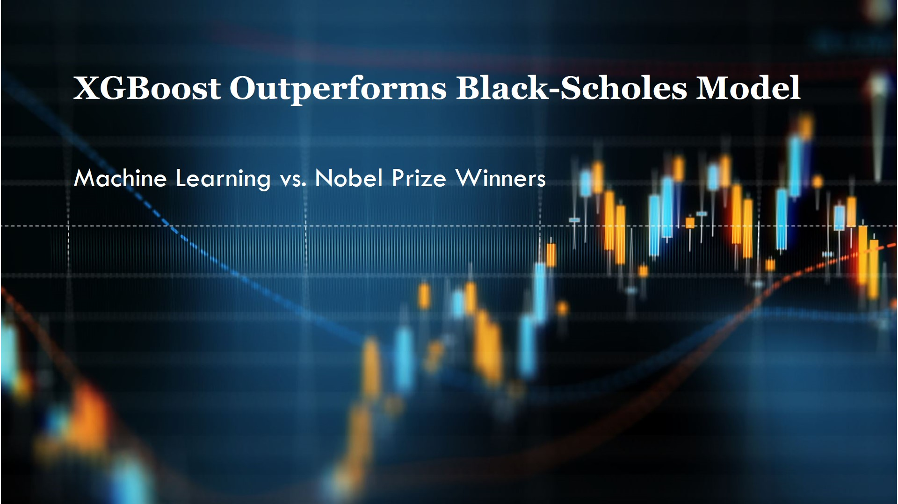
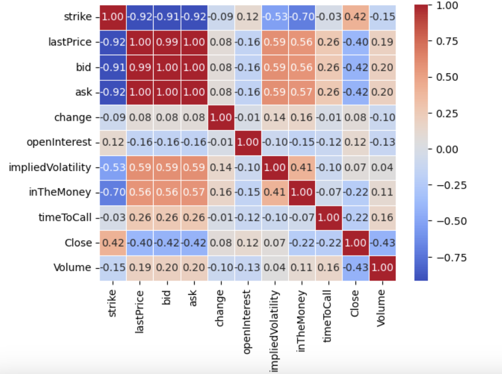
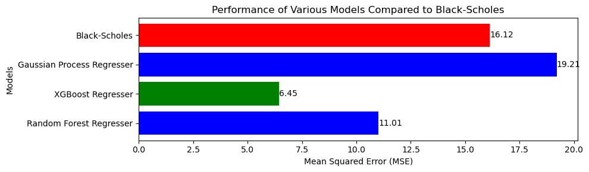

# **
Machine Learning vs. Nobel Prize Winners: XGBoost Outperforms the Black-Scholes Option Pricing Model**

**Farid Aliniaeifard**

## **Option Pricing, Black-Scholes Model, and XGBoost Regressor**

The **Black-Scholes** model, also known as the **Black–Scholes–Merton** model, is a mathematical formula that has been used for decades in options trading. Merton and Scholes were awarded the 1997 Nobel Memorial Prize in Economic Sciences for their contributions. Despite having passed away in 1995 and thus being ineligible for the award, Black was recognized for his significant contributions by the Swedish Academy. 

   
  <em>Fischer Black, Myron Scholes, and Robert C. Merton</em>

It is surprising that this model continues to be commonly applied for option pricing, especially considering the dynamic nature of the economic environment and the rise of machine learning algorithms. As a result, there is a growing need for option pricing methods that utilize machine learning algorithms, which could potentially yield better results and predictions than the Black-Scholes model.

In this study, we evaluate several machine learning algorithms to determine which one outperforms the Black-Scholes model. Our findings indicate that the XGBoost regressor significantly surpasses the performance of the Black-Scholes model.

## **Black-Scholes Model**

 We investigate option pricing strategies by incorporating advanced machine-learning techniques. Given the complexity and dynamic nature of financial markets, especially options trading, traditional models like the Black-Scholes, while foundational, often fail to capture real-world intricacies. By leveraging machine learning, we can potentially achieve more accurate and robust option pricing; we study the ticker symbol **SPY**, an **S&P 500 ETF**. 

The Black-Shoels model is a mathematical model used to price European call and put options. The assumptions in this model are

- the price of the underlying asset follows a geometric Brownian motion
- with constant volatility, and
- that the markets are efficient (no arbitrage opportunity).

The key variables in Black-Scholes mode are

- **S:** Current price of the underlying asset
- **K:** Strike price of the option
- **T:** Time to expiration in years
- **r:** Risk-free interest rate (annualized)
- **$\sigma$** Volatility of the underlying asset (which is a function of the asset's returns)

### **Black-Scholes Formula for a European Call Option:**

The price of a European call option (C) is given by the following formula: 
$$C = S.{\rm N}(d_1)-K.e^{-rT}.{\rm N}(d_2)$$ 
where 

- ${\rm N}$ is the cumulative distribution function (CDF) of the standard normal distribution.
- $d_1=\frac{ \ln\left(\frac{S}{K}\right) + \left(r+\frac{\sigma^2}{2}\right)T } {\sigma\sqrt{T}}$
- $d_2 = d_1 - \sigma \sqrt{T}$

Our primary goal is to implement machine learning algorithms using inputs that at least match those of the Black-Scholes model. Therefore, we need data on the option price and the stock price. 

## **Method Summary**

To evaluate the performance of various machine learning models against the Black-Scholes option pricing model, I employed a systematic approach that involved data acquisition, preprocessing, and model training. The following steps outline the methodology used in this study:

1. **Data Acquisition**: I sourced the relevant financial data using the `yfinance` library, which provides a comprehensive dataset for the required financial instruments.

2. **Data Cleaning and Merging** For this purpose, we merged the data for the option calls and stock price for ``SPY``. 

3. **Data Splitting**: The merged data was then split into training and testing sets to facilitate model evaluation. This step ensures that the models are trained on one subset of the data and validated on another to assess their predictive performance accurately. The target feature was the option calls price.  

4. **Principal Component Analysis (PCA)**: To reduce dimensionality and identify the most significant features, I conducted PCA. This technique allowed me to determine the components that account for 95% of the variance in the data, ensuring that only the most relevant features were used in the modeling process.

5. **Data Scaling**: Before applying machine learning algorithms, the data was scaled to standardize the features. This step is crucial for ensuring that the models perform optimally, as it prevents features with larger scales from dominating the learning process.

6. **Model Training and Tuning**: I applied several machine learning algorithms, including NGRegressor, Linear Regression, Random Forest, and XGBoost Regressor, to the preprocessed data. Each model was fine-tuned to optimize its performance. Hyperparameter tuning was performed to enhance the predictive accuracy of the models.

7. **Model Evaluation**: The performance of each model was evaluated using the mean squared error (MSE) metric. Among all the models tested, the XGBoost Regressor demonstrated the best performance, achieving the lowest MSE. This result indicates that the XGBoost Regressor outperforms the traditional Black-Scholes model in option pricing tasks.

By leveraging advanced machine learning techniques and rigorous evaluation methods, this study highlights the potential of modern algorithms to enhance financial modeling accuracy and reliability.

## **Data Acquisition**

### yfinance package

The `yfinance` package is a popular Python library used to retrieve historical market data from Yahoo Finance. It provides an easy-to-use interface to download stock and option prices, financial statements, and other financial data directly into Python for analysis, backtesting, or research purposes. The package is particularly useful for quantitative finance and data analysis tasks. We save all fetched data in a local drive.

### The ticker sympol **SPY**

The ticker symbol **SPY** represents the **SPDR S&P 500 ETF Trust**, which is an exchange-traded fund (ETF) that seeks to track the performance of the **S&P 500 Index**, a benchmark of the 500 largest publicly traded companies in the U.S. The ETF is managed by **State Street Global Advisors** (SSGA) and is one of the most popular and liquid ETFs in the world.

## **Data Cleaning and Merging**

We need both the option price and the stock price, so we merge the data of both by date. Additionally, we need to clean the data, which involves addressing all NaN values and identifying any outliers. We decided not to remove the outliers, as they are essential for our predictions.

## **EDA**

We looked at the correlation matrix and the heatmap, and then perform PCA. 

   

To reduce dimensionality and identify the most significant features, I conducted PCA. This technique allowed me to determine the components that account for 95% of the variance in the data, ensuring that only the most relevant features were used in the modeling process. We end up with the fact that all the data is needed to reach 95% accuracy. Our target variable is ``lastPrice``. 

## **Model Selection** 

**Model Training and Tuning**: I implemented a variety of machine learning algorithms to analyze the preprocessed data, specifically NGRegressor, Linear Regression, Random Forest, and XGBoost Regressor. Each model was fine-tuned to maximize its performance and ensure accurate predictions. To further improve the predictive accuracy of these models, I conducted an extensive hyperparameter tuning process, adjusting various parameters to achieve optimal results tailored to the specific characteristics of the dataset.

**Model Evaluation**: The performance of each model was rigorously assessed utilizing the mean squared error (MSE) metric, a standard measure for evaluating the accuracy of regression models. Among all the models analyzed, the XGBoost Regressor stood out by delivering the most impressive results, as it recorded the lowest MSE. This significant finding suggests that the XGBoost Regressor not only excelled compared to its competitors but also surpassed the traditional Black-Scholes model, which is widely used for option pricing. This indicates a notable advancement in the accuracy of option pricing tasks, highlighting the effectiveness of the XGBoost Regressor in this domain.

   

## **Conclusion** 

The findings of this study suggest that machine learning algorithms offer advantages over traditional methods, such as the Black-Scholes option pricing model. Through the application of models like XGBoost, we have seen how machine learning can outperform techniques in terms of prediction accuracy, particularly when assessed using metrics like Mean Squared Error (MSE).

By leveraging the power of advanced algorithms, machine learning provides a more flexible, data-driven approach to option pricing, capable of capturing complex relationships within financial data that traditional models may miss. The ability to adapt and improve over time makes machine learning a powerful tool for modern financial markets, where volatility and non-linear dynamics are prevalent.

As the financial industry continues to embrace technological advancements, integrating machine learning into option pricing models not only promises greater accuracy but also opens new avenues for optimization and risk management. It is clear that machine learning holds the potential to revolutionize the way financial professionals approach derivatives pricing.
